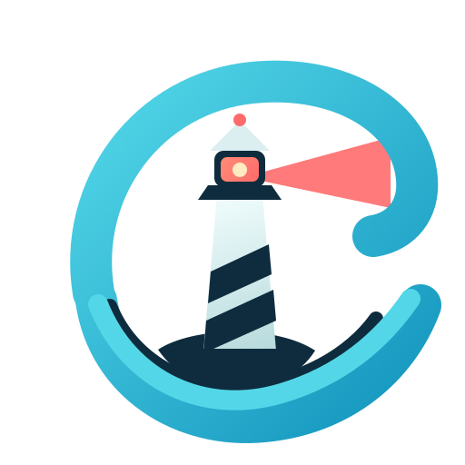

# ThalassaOps desktop shell

<p align="center">
  
</p>

ThalassaOps is a local-first command center for the people who keep software and
infrastructure running. It brings signals from Kubernetes, cloud, virtual
machines, observability tools and delivery systems into one place, so an
operator can move from “something is wrong” to “here is the evidence” to “here
is the safest next step.”

> Turn fragmented operational signals into an evidence-backed incident
> workflow, then help teams take safe and auditable action from one command
> center.

## Requirements at a glance

ThalassaOps is designed for DevOps, Platform and Cloud Engineers, with useful
views for security engineers, incident commanders, service owners and managers.
The product should:

- connect the systems teams already use instead of replacing their telemetry
  backends;
- make the path from alert or anomaly to shared incident understanding clear;
- keep evidence, impact, ownership, actions and audit history together;
- help AI investigate through scoped tools and cited evidence, without making it
  the final authority;
- support local-first use today and team and enterprise controls over time.

### From signal to safe action

The core experience follows a simple sequence:

1. **Notice a signal.** Start with an alert, anomaly, user report, scheduled
   check, vulnerability or manually created incident.
2. **Build the context.** Connect the signal to the affected environment,
   resources, recent changes and related signals.
3. **Find the evidence.** Bring together logs, metrics, traces, events,
   deployments, topology and security findings while removing irrelevant or
   sensitive data.
4. **Understand the impact.** Explain what is affected, how serious it is and
   what remains uncertain. Severity is based on business impact and is kept
   separate from urgency and priority.
5. **Choose the next step.** Offer a recommendation or a governed action with
   expected impact, approval requirements and a recovery plan.
6. **Verify and learn.** Confirm the result, communicate it and keep the
   investigation and action history available for audit and follow-up.

Incidents are intended to move through `Detected → Triage → Investigating →
Mitigating → Monitoring → Resolved → Closed`, with `Reopened` available when
verification fails or the problem returns.

### What it connects

The requirements cover a broad operational landscape, delivered in stages:

- **Infrastructure:** Kubernetes, VMs, bare metal, AWS, Azure, GCP,
  serverless platforms and network components.
- **Observability:** Prometheus, Alertmanager, Grafana, Loki, OpenTelemetry and
  additional metrics, logging and tracing systems.
- **Delivery and collaboration:** GitHub, GitLab, Argo CD, CI/CD systems, Jira,
  Slack, Discord and incident-management tools.
- **Security and compliance:** Trivy, Falco, Kyverno, OPA Gatekeeper and later
  cloud security and policy services.
- **AI providers:** hosted providers, Ollama, vLLM, local models and
  OpenAI-compatible custom endpoints.

### AI that helps without taking control

AI investigations should be structured and honest. Each finding should show
where it came from, how confident it is, what context was missing and what to
do next. The assistant uses capability-scoped tools, curated context and
redaction before model use; it never acts as its own authorization layer.

Actions are classified separately from how they are allowed to run:

- `READ-ONLY` — inspect or evaluate without changing anything;
- `MUTATING` — can change an environment or external system;
- `REQUIRES APPROVAL` — waits for the required human decision;
- `BLOCKED` — not permitted by policy.

Automatic mutation is disabled by default. A narrowly scoped `POLICY_AUTO`
action must still pass resource, environment, blast-radius, rollback and
post-action verification checks.

### Safety and trust

Secrets, credentials, tokens, private keys and regulated data must not be sent
to hosted AI providers. Data rules separately control model egress, local
storage, screen display, exports and audit retention. If classification,
redaction or egress validation cannot be confirmed, external transmission
fails closed.

The interface is dark-mode-first, accessible without relying on color alone,
available in Thai and English, and keeps native links and raw queries available
for expert users. The primary home is an Operations Console; deeper work takes
place in an Incident Workspace with evidence, AI findings, policy state and
actions visible together.

### Product boundaries

ThalassaOps is not intended to replace Prometheus, Grafana, Loki or other
established telemetry backends. It should connect to them, preserve their
native context and make the operational workflow easier to follow. It should
not send unrestricted production context to an AI provider, let a model approve
its own mutation or hide raw queries from expert users.

Provisioning may become a separate future bounded context; it is not part of the
initial incident-control product.

## Project status and direction

This repository is building the product in small, testable delivery slices. It
currently provides the Tauri 2 desktop shell, Rust core, React/TypeScript UI,
secure capability-scoped IPC, local SQLite workspace state, connector
management, Kubernetes read-only workflows, the first observability
integrations, read-only cross-cloud inventory for AWS, Azure and GCP, the
Operations Console home experience, the resource and service topology
workspace, signal normalization with security findings and correlation,
read-only change intelligence that shows what changed before a correlated
problem, and a canonical local-first Incident domain: permitted responders
create Incidents explicitly from six trigger kinds and advance them through a
validated, actor-attributed lifecycle with an immutable audit timeline.

The latest approved design is [Sprint 15 — incident domain and lifecycle](docs/design/sprint-15-incident-domain-lifecycle.md).
The complete product sequence is tracked in the [product sprint plan](docs/planning/sprint-plan.md).
For the full source of truth, see the [requirements summary](docs/requirements/requirements-summary.md)
and the [working system requirements](docs/requirements/system-requirements.md).

## Commands

Install JavaScript dependencies once:

```bash
npm install
```

Run the desktop app in development mode (Tauri performs normal macOS development/ad-hoc signing):

```bash
npm run tauri:dev
```

Run checks and produce an ad-hoc-signed macOS application bundle:

```bash
cargo test --workspace
npm run typecheck
npm test
npm run tauri:build
```

`npm run lint`, `npm run format:check`, `cargo fmt --all -- --check`, and `cargo clippy --workspace --all-targets -- -D warnings` are the corresponding lint/format checks.

## Health-check verification

1. Run `npm run tauri:dev` on macOS and wait for the ThalassaOps window. The
   shell should bootstrap a local workspace and load its organization, team,
   workspace and policy context through the secured IPC boundary.
2. Open the Integrations area and add the built-in fixture connector to verify
   the connector lifecycle without live infrastructure.
3. To verify a packaged app, run `npm run tauri:build` and open
   `target/release/bundle/macos/ThalassaOps.app`.

The automated Rust and frontend checks cover the same command, authorization,
local-state and connector paths with fixtures and local test data.

## Local state

Startup applies embedded SQL files from `src-tauri/migrations/` using a
`schema_migrations` ledger. It then creates a local administrator, an
Organization → Team → Workspace hierarchy, workspace-owner membership and the
baseline policy when they do not already exist. The SQLite database lives in
Tauri’s application-data directory as `thalassaops.sqlite`.

Credentials are kept in the operating system keychain rather than in ordinary
SQLite metadata. The project is licensed under [Apache License 2.0](LICENSE).
